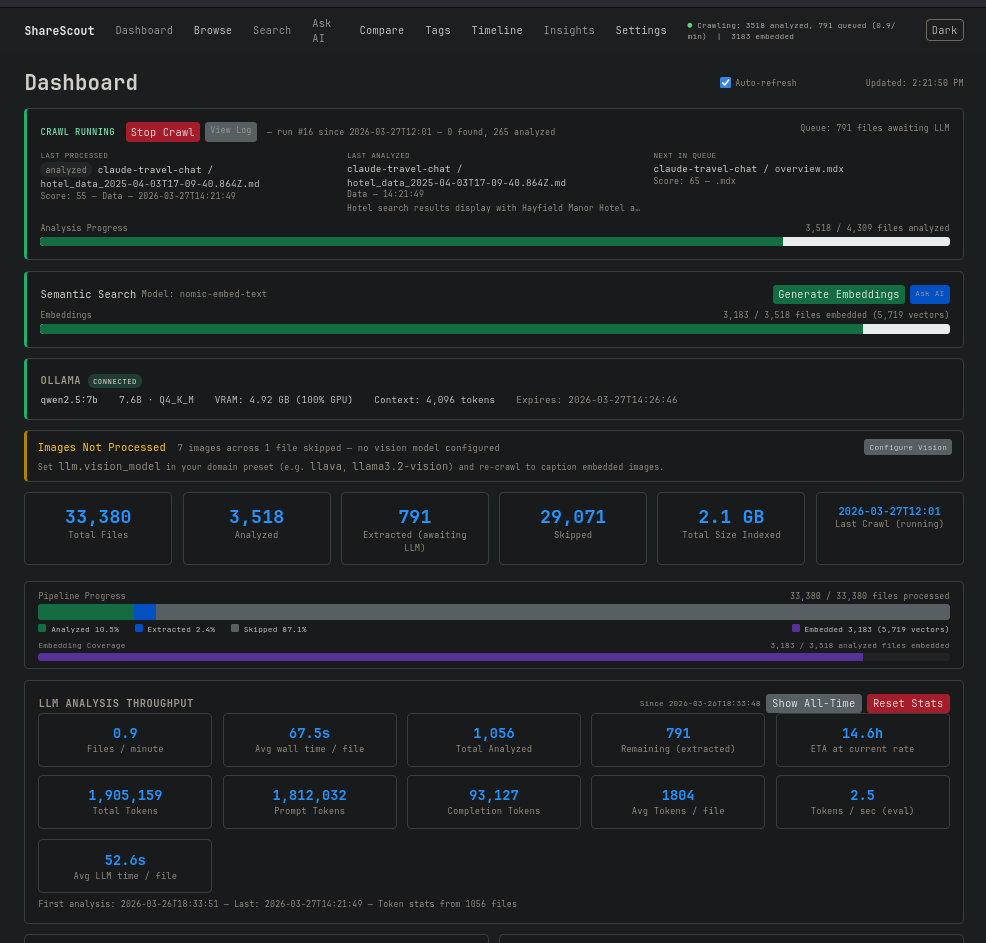
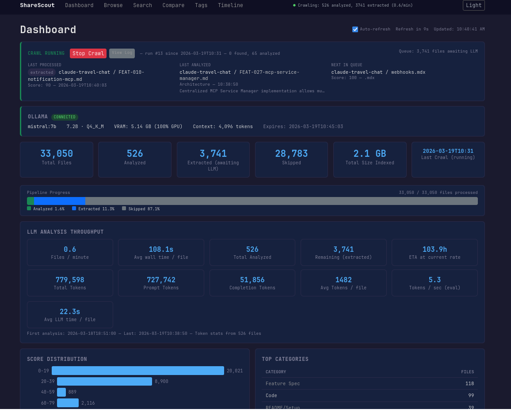
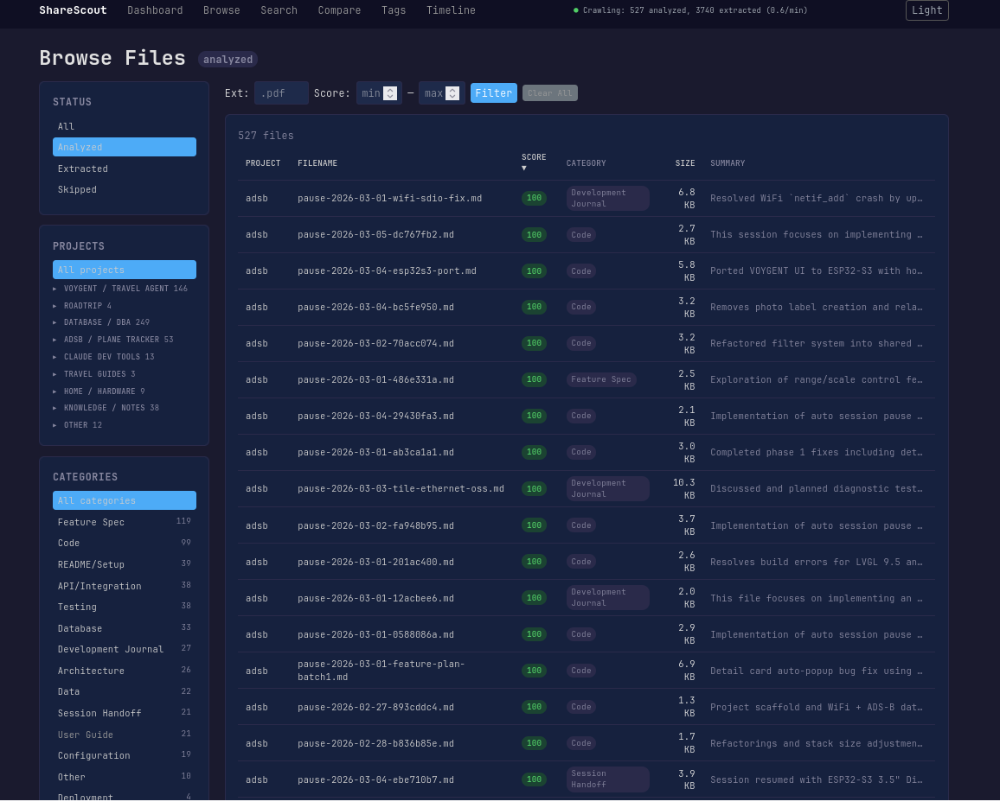
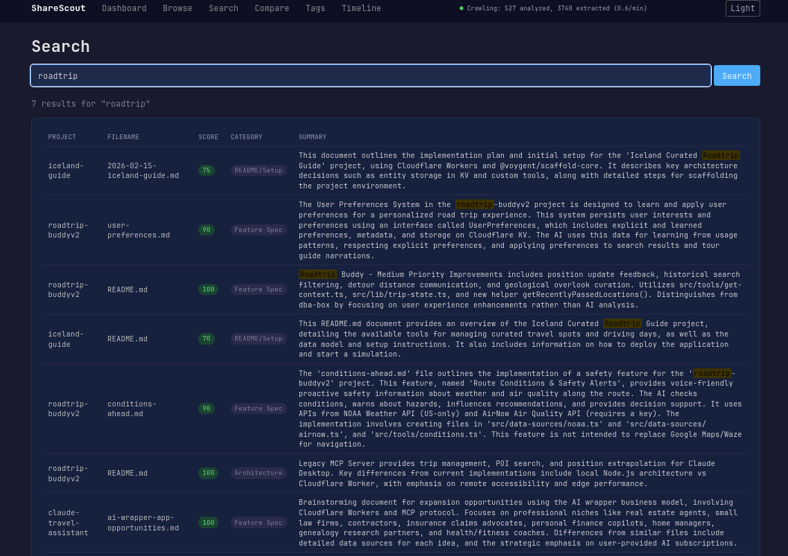
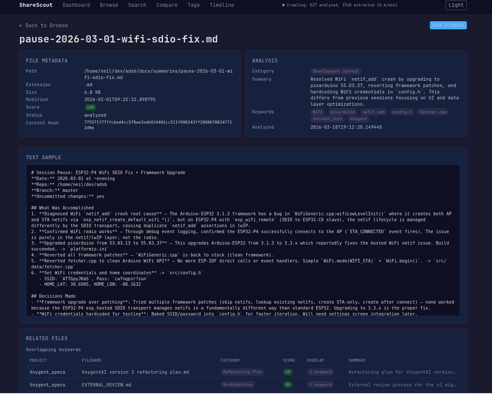
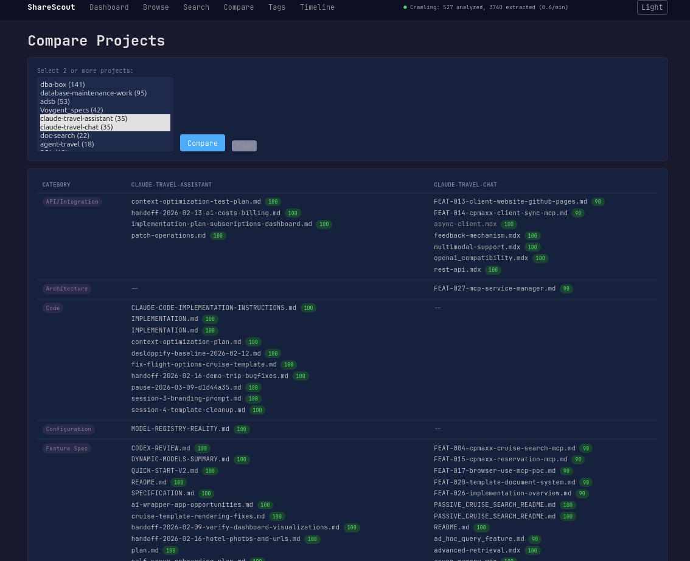
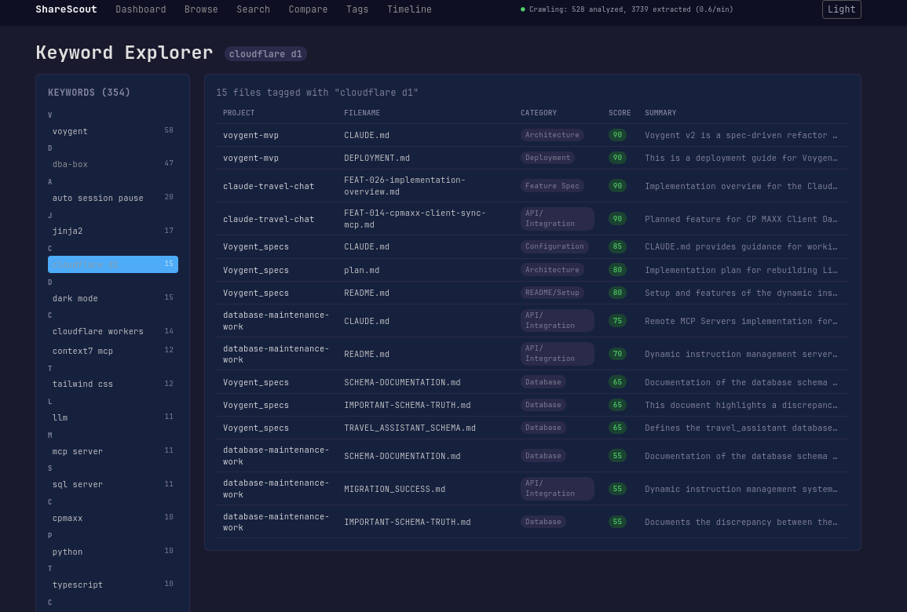
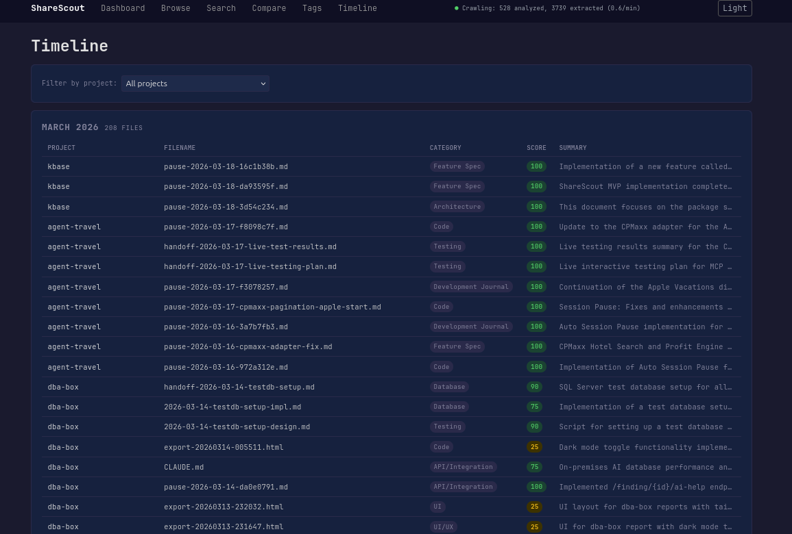

# ShareScout

**Document discovery and knowledge base builder**

Crawls project directories, scores files by relevance, extracts text, and uses an LLM to summarize and categorize everything into a searchable catalog. Includes full-text search, RAG-powered semantic search, image captioning, a web UI, and an MCP server for AI coding assistant integration.



## Features

- **Automatic file discovery** with configurable relevance scoring
- **LLM-powered summarization and categorization** — works with Ollama (local, free, private) or any OpenAI-compatible API
- **RAG semantic search** — embed documents with `nomic-embed-text`, query with natural language, get sourced answers
- **Image captioning** — extract and caption images from PDFs, DOCX, and PPTX using vision models
- **Full-text search** with SQLite FTS5
- **MCP server** — expose search and RAG tools to Claude Code or any MCP-compatible client
- **Web UI with 8 views:** Dashboard, Browse, Search, Compare, Tags, Timeline, Insights, File Detail
- **Resume-safe crawling** with checkpoint support — interrupt and resume without reprocessing
- **Project grouping** and cross-project analysis

## Quick Start

```bash
git clone https://github.com/iamneilroberts/sharescout.git
cd sharescout
python -m venv .venv
source .venv/bin/activate
pip install -r requirements.txt

# Copy and customize config
cp config.example.yaml config.yaml
cp scoring_rules.example.yaml scoring_rules.yaml
cp project_groups.example.yaml project_groups.yaml

# Edit config.yaml — set root_path to your project directory

# Run a crawl
python -m share_scout crawl

# Start the web UI
python -m share_scout web
# Open http://localhost:8080
```

## LLM Setup

ShareScout works without an LLM — it will crawl, score, and extract text regardless. The LLM adds summaries, categories, keywords, embeddings, and image captions.

### Ollama (local, free, private)

```bash
# Install from https://ollama.com
ollama pull qwen2.5:7b          # summarization
ollama pull nomic-embed-text    # embeddings for RAG search
```

Default config points to `localhost:11434`. No other setup needed.

For image captioning, pull a vision-capable model and set `vision_model` in your config or preset.

### OpenAI-compatible API

In `config.yaml`, uncomment the `openai:` section and comment out the `ollama:` section. Set your API key:

```bash
echo "OPENAI_API_KEY=sk-..." > .env
```

Works with any OpenAI-compatible endpoint (OpenAI, Anthropic, local vLLM, etc.).

## RAG Semantic Search

After crawling, documents are automatically embedded and stored as vectors in SQLite using the `sqlite-vec` extension. Large documents are split into overlapping chunks with intelligent boundary detection.

```bash
# Ask questions against your catalog
python -m share_scout ask "How does authentication work?"

# Query mode — extractive answers with source attribution
python -m share_scout ask "Which projects use WebSockets?" --mode query

# Chat mode — freeform answers grounded in retrieved context
python -m share_scout ask "Explain the database schema" --mode chat
```

Searches match against LLM-written summaries of what files are about, not just the raw text they contain.

## Image Captioning

Documents containing images (PDFs, DOCX, PPTX) have their images extracted, deduplicated by content hash, and captioned using a vision model. Captions are inserted inline so the LLM sees visual content in context during analysis. Small images (<100x100px) are skipped to filter out logos and icons.

Configure a vision model in your config or preset:

```yaml
ollama:
  vision_model: llava
```

## MCP Server

ShareScout includes an MCP server that exposes four tools over stdio:

| Tool | Description |
|------|-------------|
| `search` | Full-text search across summaries, keywords, and extracted text |
| `ask` | RAG-powered semantic search with LLM-generated answers and source attribution |
| `get_file` | Retrieve full file details — metadata, summary, keywords, category |
| `list_categories` | List available categories with file counts |

### Claude Code Integration

Add to `.mcp.json` in your project root:

```json
{
  "mcpServers": {
    "sharescout": {
      "command": "/path/to/sharescout/sharescout-mcp.sh"
    }
  }
}
```

Claude Code will automatically load the MCP server and can query your entire catalog as tool calls — searching thousands of analyzed files in seconds instead of grepping one at a time.

## Web UI

### Dashboard

Overview of your catalog — file counts, category breakdown, project distribution, and crawl status.



### Browse

Filter files by category, extension, project, or score range.



### Search

Full-text search across all extracted text and AI-generated summaries.



### File Detail

Individual file view with AI summary, text sample, metadata, and related files.



### Compare

Compare projects side by side — file types, categories, and key documents.



### Keywords

Explore auto-generated tags and keywords across your catalog.



### Timeline

View files chronologically by modification date.



## How Scoring Works

Files are scored using additive rules defined in `scoring_rules.yaml`:

- **Extension scores** — `.md` (+50), `.pdf` (+40), `.py` (+30), etc.
- **Path patterns** — `docs/` (+20), `features/` (+25), `README` (+30), etc.
- **File size** — bonus for moderate sizes, penalty for very large files

Files scoring below the threshold (default: 35) are skipped. This keeps the catalog focused on meaningful documents. Fully customizable — edit `scoring_rules.yaml` to tune for your projects.

## Configuration

| File | Purpose |
|------|---------|
| `config.yaml` | Crawl root path, LLM provider settings, database path, web server host/port |
| `scoring_rules.yaml` | Extension scores, path pattern boosts, size rules, score threshold |
| `project_groups.yaml` | Organize discovered projects into named groups for the sidebar |

See the `.example.yaml` files for documented templates with all available options.

## CLI Reference

```
python -m share_scout crawl [--root-path PATH] [--dry-run] [--ollama-model MODEL]
python -m share_scout web [--host HOST] [--port PORT]
python -m share_scout ask "your question" [--mode query|chat]
```

Use `--dry-run` to preview scoring without extraction or LLM calls.

## License

MIT
