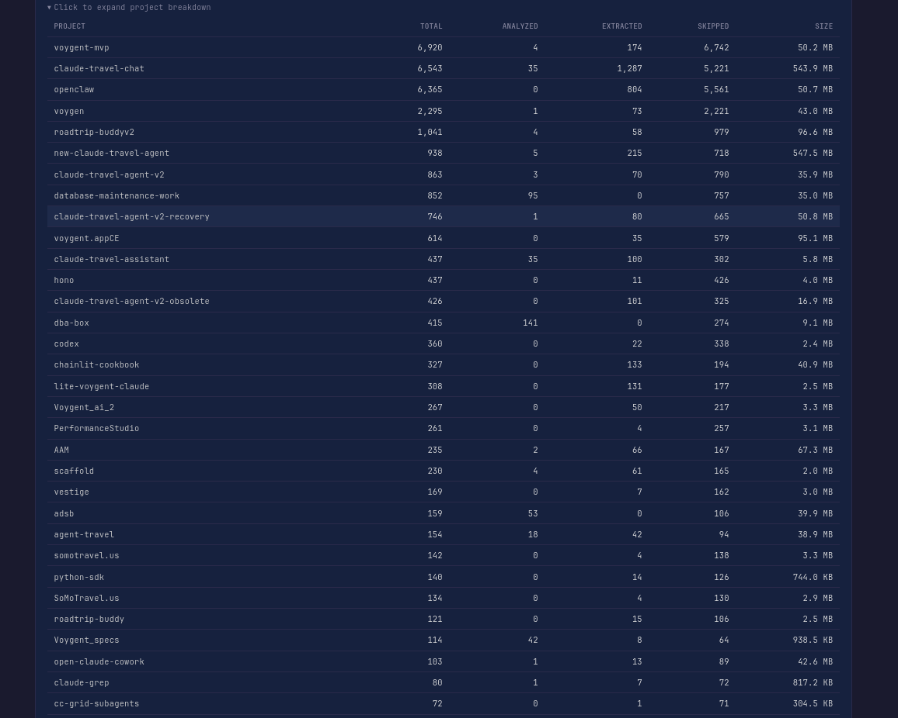

# ShareScout

**Document discovery and knowledge base builder**

Crawls project directories, scores files by relevance, extracts text, and uses an LLM to summarize and categorize everything into a searchable catalog with a web UI. Point it at a directory full of projects and get an organized, searchable knowledge base with AI-generated summaries, keywords, and cross-project analysis.


## Features

- **Automatic file discovery** with configurable relevance scoring
- **LLM-powered summarization and categorization** — works with Ollama (local, free, private) or any OpenAI-compatible API
- **Full-text search** with SQLite FTS5
- **Web UI with 8 views:** Dashboard, Browse, Search, Compare, Tags, Timeline, Insights, File Detail
- **Resume-safe crawling** with checkpoint support — interrupt and resume without reprocessing
- **Project grouping** and cross-project analysis

## Quick Start

```bash
git clone https://github.com/iamneilroberts/sharescout.git
cd sharescout
python -m venv .venv
source .venv/bin/activate
pip install -r requirements.txt

# Copy and customize config
cp config.example.yaml config.yaml
cp scoring_rules.example.yaml scoring_rules.yaml
cp project_groups.example.yaml project_groups.yaml

# Edit config.yaml — set root_path to your project directory

# Run a crawl
python -m share_scout crawl

# Start the web UI
python -m share_scout web
# Open http://localhost:8080
```

## LLM Setup

ShareScout works without an LLM — it will crawl, score, and extract text regardless. The LLM adds summaries, categories, and keywords.

### Ollama (local, free, private)

```bash
# Install from https://ollama.com
ollama pull mistral:7b
```

Default config points to `localhost:11434`. No other setup needed.

### OpenAI-compatible API

In `config.yaml`, uncomment the `openai:` section and comment out the `ollama:` section. Set your API key:

```bash
echo "OPENAI_API_KEY=sk-..." > .env
```

Works with any OpenAI-compatible endpoint (OpenAI, Anthropic, local vLLM, etc.).

## Web UI

### Dashboard

Overview of your catalog — file counts, category breakdown, project distribution, and crawl status.



### Browse

Filter files by category, extension, project, or score range.


### Search

Full-text search across all extracted text and AI-generated summaries.


### File Detail

Individual file view with AI summary, text sample, metadata, and related files.


### Compare

Compare projects side by side — file types, categories, and key documents.


### Keywords

Explore auto-generated tags and keywords across your catalog.


### Timeline

View files chronologically by modification date.


## How Scoring Works

Files are scored using additive rules defined in `scoring_rules.yaml`:

- **Extension scores** — `.md` (+50), `.pdf` (+40), `.py` (+30), etc.
- **Path patterns** — `docs/` (+20), `features/` (+25), `README` (+30), etc.
- **File size** — bonus for moderate sizes, penalty for very large files

Files scoring below the threshold (default: 35) are skipped. This keeps the catalog focused on meaningful documents. Fully customizable — edit `scoring_rules.yaml` to tune for your projects.

## Configuration

| File | Purpose |
|------|---------|
| `config.yaml` | Crawl root path, LLM provider settings, database path, web server host/port |
| `scoring_rules.yaml` | Extension scores, path pattern boosts, size rules, score threshold |
| `project_groups.yaml` | Organize discovered projects into named groups for the sidebar |

See the `.example.yaml` files for documented templates with all available options.

## CLI Reference

```
python -m share_scout crawl [--root-path PATH] [--dry-run] [--ollama-model MODEL]
python -m share_scout web [--host HOST] [--port PORT]
```

Use `--dry-run` to preview scoring without extraction or LLM calls.

## License

MIT
